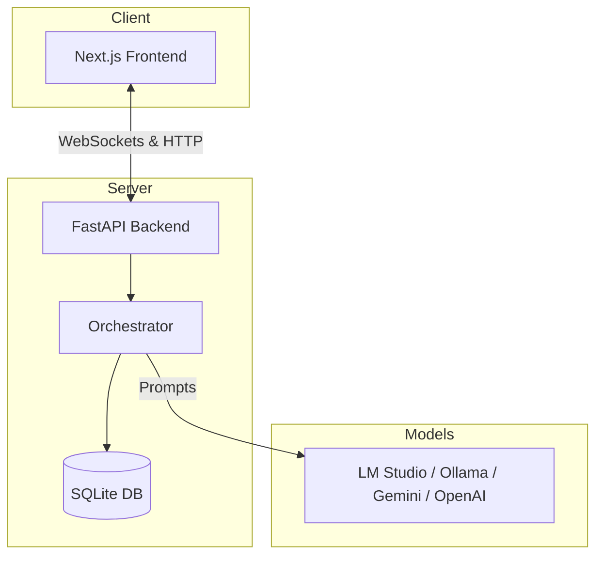

# Incident Dashboard POC

A real-time log ingestion and incident analysis dashboard that monitors system logs, triages severity, and uses LLMs to generate recommended incident resolution playbooks/recovery runbooks.

---

## Architecture Overview



- **Frontend**: Next.js (React) application displaying live log feeds, incident priorities, and runbook recommendations.
- **Backend**: FastAPI (Python) server containing the orchestrator, log collector, rule-based triage fallback, and LLM services.
- **LLM Integrations**: Configurable providers including local providers (**LM Studio**, **Ollama**) and cloud providers (**Gemini**, **OpenAI**).

---

## Getting Started

### Prerequisites
- **Python**: version 3.10+
- **Node.js**: version 18+

### 1. Installation

Install frontend dependencies:
```bash
cd frontend
npm install
cd ..
```

Install backend dependencies globally or in your virtual environment:
```bash
pip install -r backend/requirements.txt
```

---

## Configuration

Copy the example environment file and configure the settings:
```bash
cp .env.example .env
```

Open `.env` and configure the following variables:
- `LLM_PROVIDER`: Choose your active provider (`lmstudio`, `ollama`, `openai`, `gemini`, or `mock`).
- `LMSTUDIO_API_KEY`: Enter your LM Studio server API key if authentication is enabled.
- `LLM_BASE_URL`: Custom API base URL (e.g. `http://localhost:1234/v1` for LM Studio).
- `LLM_MODEL`: Model name to target (e.g. `gemma-4-26b-a4b-qat`).

---

## Running the Application

### Step 1: Start the Backend (FastAPI)
Run the following from the project root:
```bash
python3 -m uvicorn backend.main:app --reload --port 8000
```
- API Documentation is available at `http://localhost:8000/docs`.
- Logs are watched and triaged in real time.

### Step 2: Start the Frontend (Next.js)
Open a new terminal and run:
```bash
cd frontend
npm run dev
```
- The application will be live at `http://localhost:3000`.

---

## Running Verifications & Tests

To ensure the backend, API flows, and frontend are correctly set up and functional, run the verification scripts:

- **Verify Backend & DB Functions**:
  ```bash
  python3 verify_brain.py
  ```
- **Verify API and Integration Fallbacks**:
  ```bash
  python3 verify_nervous_system.py
  ```
- **Verify Frontend File Structure**:
  ```bash
  python3 verify_face.py
  ```
