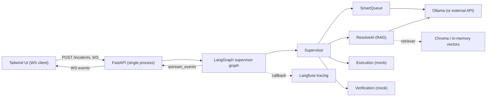
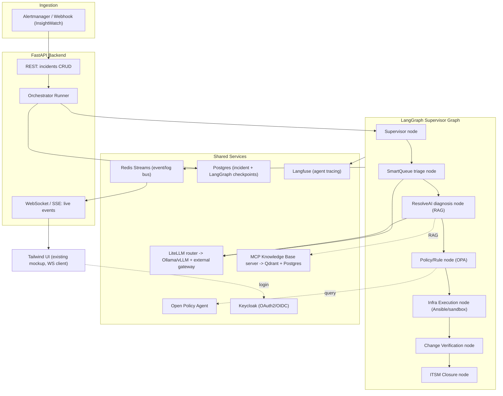

# Agentic Incident Resolution Platform - Technical Implementation Plan

## 1. Evaluation of the current Incident Details page

The mockup ([incident_resolution_dashboard (5).html](c:/Users/yasheshs/Downloads/incident_resolution_dashboard%20(5).html)) is a high-fidelity **front-end simulation only**. Everything is driven by a hard-coded `simulationSequence` array and `setTimeout` timers - there is no backend, no real agents, and no live data.

What it gets right (and we keep):
- Clear supervisor/subagent topology (`node-supervisor` + `node-sub-*`).
- Four well-defined UI surfaces we must power with real data:
  - **Incident Workflow** header (`#incident-id-label`, priority/AI-match/category/status badges).
  - **AI Resolution Summary** (`#resolution-summary`, `#summary-rca`, `#summary-action`).
  - **Resolution Progress** stepper (`#flow-container`, `#progress-bar`, `step-0..3`).
  - **Real-time Agent Logs** (`#log-container`, colored per-agent).
- Named agents that map cleanly to real components: `InsightWatch` (monitor), `SmartQueue` (triage), `ResolveAI`+`KnowledgeAgent` (diagnosis/RAG), `Supervisor`, and `Policy`, `Infrastructure Execution`, `Change Verification` subagents, plus an MCP Knowledge Base and an A2A security layer.

Gaps to close: no orchestration engine, no LLM, no knowledge base, no tool execution, no policy/approval gates, no persistence, no auth, and the log/step/node state comes from a fixed script rather than actual agent events.

---

# TRACK A - Minimal demo (real orchestration + tracing, least complexity)

Goal: keep the two things that make it a *real* agentic demo (genuine multi-agent orchestration and real observability) and cut everything that is pure ops overhead for a demo. It runs as **one Python process** (plus a local LLM), no message broker, no external DBs, no auth stack.

## A1. What is kept vs cut vs faked

- **Kept real**:
  - LangGraph supervisor + subagent graph (real routing, real state, real tool calls).
  - Real LLM calls (local via Ollama, or an external API key - just an env var).
  - Real tracing: **Langfuse** capturing every node, prompt, tool call, latency, token cost. This is the demo centerpiece alongside the UI.
  - RAG diagnosis over a small local knowledge base of runbooks.
  - Human-in-the-loop approval (cheap and impressive to show).
- **Cut for the demo** (deferred to Track B): Redis, Qdrant server, OPA, Keycloak, mTLS, Prometheus/Alertmanager, LiteLLM router, standalone MCP server, Ansible.
- **Real in this demo (see A6 scenario)**: a single **Postgres** instance is used as the incident store and trigger source (your kill-script writes to it), and the fix is a **real Cloudflare API call** that repairs a Cloudflare Tunnel - not a mock.
- **Faked / simplified**:
  - ITSM closure: writes status back to Postgres, no ServiceNow.

## A2. Minimal stack

- **Orchestration**: Python + **LangGraph** (`StateGraph`, supervisor pattern), checkpointer = in-memory `MemorySaver` (or SQLite for persistence across restarts).
- **Backend/UI transport**: **FastAPI** with a WebSocket endpoint; stream `graph.astream_events(...)` directly to the browser - no Redis needed in a single process.
- **LLM**: **Ollama** running a small local model (e.g. `llama3.1:8b` / `qwen2.5`) via `langchain-ollama`; swap to an external API by changing one env var. (LiteLLM router stays a Track B upgrade.)
- **Knowledge base (RAG)**: in-process **Chroma** (embedded, no server) or LangChain `InMemoryVectorStore`, seeded from a few markdown runbooks; exposed to `ResolveAI` as a retriever tool.
- **Tracing**: **Langfuse** via the LangChain/LangGraph callback handler. Use **Langfuse Cloud free tier** (just 2 API keys, zero containers) for the leanest setup, or run the single official `langfuse` docker image if data must stay local.
- **State store + trigger**: **Postgres** holds `incidents` + `incident_events`; a table trigger emits `NOTIFY` and the backend `LISTEN`s to start runs (see A6). LangGraph checkpointer stays `MemorySaver` (durable record lives in Postgres).
- **Fix + verify tooling**: `httpx` for Cloudflare API calls and the HTTP health check; `cloudflared` running a **remotely-managed** tunnel (required so the tunnel config is editable via API).

Result: `docker compose up postgres` (one container) + `ollama serve` + `uvicorn backend.main:app`, with `cloudflared` running your tunnel. Langfuse via cloud keys (or add its one container).

## A3. Minimal architecture



## A4. How the four UI surfaces stay real

Same as Track B section 5, but events come straight from `astream_events` in-process (no broker). The LangGraph `IncidentState` (section 4) still drives Workflow header, Progress stepper, and AI Resolution Summary; each node calls an `emit()` that sends a WS frame. Every run also produces a **Langfuse trace URL** the presenter can open live to show "this is a real agent, here are its actual prompts, tool calls, tokens and latency" - which is the credibility payoff of the demo.

## A5. Minimal delivery order

1. FastAPI app + serve the existing HTML; add WebSocket endpoint.
2. LangGraph supervisor + SmartQueue/ResolveAI/Execution/Verification nodes with `emit()` events.
3. Wire Ollama LLM + attach Langfuse callback handler; confirm traces appear.
4. Seed 3-5 runbooks into embedded Chroma; wire RAG into ResolveAI.
5. Re-wire the HTML JS from `simulationSequence` to the WebSocket client; add Approve/Reject for HITL.
6. Wire the concrete Cloudflare Tunnel scenario (A6): Postgres schema + NOTIFY listener, Cloudflare API execution/verification, kill-script.

## A6. Concrete demo scenario - Cloudflare Tunnel outage, auto-repaired

Storyline: a kill-script breaks the Cloudflare Tunnel ingress mapping for the site and records an incident in Postgres. The orchestrator is woken via Postgres `LISTEN/NOTIFY`, its agents categorize -> diagnose -> repair the tunnel via the Cloudflare API -> verify the site is back, updating the incident status at every step (visible live in the UI and in Langfuse).

Prerequisite: the tunnel must be a **remotely-managed** Cloudflare Tunnel (config stored at Cloudflare), otherwise the configuration API is ignored in favor of a local `config.yml`. A Cloudflare **API token** scoped to `Account > Cloudflare Tunnel > Edit` is stored in `.env`. The origin site runs locally (e.g. on `localhost:8080`) with `cloudflared` exposing it at a public hostname.

### Postgres schema + trigger

- `incidents`: `id`, `title`, `description`, `source`, `status`, `priority`, `category`, `rca`, `action`, `summary`, `public_url`, `account_id`, `tunnel_id`, `hostname`, `created_at`, `updated_at`, `resolved_at`.
- `incident_events`: `id`, `incident_id`, `ts`, `agent`, `event_type`, `message`, `detail`, `payload` (jsonb) - this is the audit trail that also feeds the Agent Logs UI and enables replay.
- Trigger: `AFTER INSERT ON incidents` runs a function that calls `pg_notify('incident_new', NEW.id::text)`.

### Trigger -> orchestrator (LISTEN/NOTIFY)

- On startup the backend opens a dedicated `asyncpg` connection and runs `LISTEN incident_new;`.
- On a notification it loads the incident row and launches a LangGraph run as a background asyncio task. This is the real "InsightWatch" ingestion agent.
- Robustness: on startup it also reconciles any `status='NEW'` rows created while it was down (so no incident is missed).

### Agent flow (each step updates `incidents.status` + writes an `incident_events` row + emits a WS event)

```mermaid
sequenceDiagram
  participant K as Kill-script
  participant PG as Postgres
  participant L as NOTIFY Listener (InsightWatch)
  participant S as Supervisor
  participant T as SmartQueue (Triage)
  participant D as ResolveAI (Diagnosis + RAG)
  participant E as Execution (Cloudflare API)
  participant V as Verification (HTTP)
  participant CF as Cloudflare API
  participant U as UI (WebSocket)

  K->>CF: PUT broken tunnel ingress (remove hostname->service)
  K->>PG: INSERT incident (status=NEW)
  PG-->>L: NOTIFY incident_new
  L->>S: start run; status=TRIAGING
  S->>T: categorize
  T->>D: category=Availability, priority=P1; status=DIAGNOSING
  D->>CF: GET tunnel configuration
  D->>D: RAG runbook + compare config -> RCA: ingress rule missing
  D->>E: action=restore ingress mapping; status=EXECUTING
  E->>CF: PUT corrected tunnel configuration
  E->>V: status=VERIFYING
  V->>CF: GET public hostname (retry w/ backoff)
  CF-->>V: HTTP 200
  V->>PG: status=RESOLVED + summary; resolved_at
  Note over S,U: every transition emits WS events -> live UI + Langfuse trace
```

Status lifecycle: `NEW -> TRIAGING -> DIAGNOSING -> [AWAITING_APPROVAL] -> EXECUTING -> VERIFYING -> RESOLVED | FAILED`.

### Cloudflare API calls used

- Read current config (diagnosis): `GET /accounts/{account_id}/cfd_tunnel/{tunnel_id}/configurations`.
- Repair (execution): `PUT /accounts/{account_id}/cfd_tunnel/{tunnel_id}/configurations` with the corrected `config.ingress` (restore `{hostname, service: "http://localhost:8080"}` plus a catch-all `{service: "http_status:404"}`).
- Optional connector health: `GET /accounts/{account_id}/cfd_tunnel/{tunnel_id}/connections`.
- Auth: `Authorization: Bearer <CF_API_TOKEN>`. The expected-good ingress is stored in a runbook/`.env` so diagnosis is deterministic yet still LLM-reasoned.

### Kill-script (demo trigger)

A small standalone script (`scripts/break_tunnel.py`) that: (1) `PUT`s a broken ingress config via the Cloudflare API (e.g. drops the hostname rule or points it at a dead port), then (2) `INSERT`s an incident row (`status='NEW'`, symptom "website returns 502/1033", `public_url`, `tunnel_id`, `hostname`). Running it is the entire demo trigger - the incident then appears in the list and resolves itself on screen.

### UI touches

- Incident list (Tab 1) subscribes to a global WS (or polls `GET /incidents`) so the new incident pops in the instant the kill-script runs; clicking it opens the live detail stream.
- The detail WS replays `incident_events` on connect, then streams live updates into logs / nodes / stepper / progress / summary using the existing DOM helpers.

Everything below (Track B) is the same design at production scale - the demo is a strict subset, so nothing has to be thrown away when scaling up.

---

# TRACK B - Full open-source reference architecture

## 2. Target architecture (open-source, hybrid LLM, LangGraph)



## 3. Mockup component -> open-source tool mapping

- **InsightWatch (monitoring)**: Prometheus + Alertmanager webhook -> FastAPI `/webhook/alert`. POC can also POST a sample alert manually.
- **SmartQueue (triage)**: LangGraph node = rules + small LLM to set priority/category/`AI Match %`.
- **ResolveAI + KnowledgeAgent (diagnosis)**: LangGraph RAG node querying the MCP Knowledge Base (vector search + historical configs).
- **Supervisor Orchestration**: LangGraph `StateGraph` supervisor routing to subagents.
- **Knowledge Base (MCP)**: Python MCP server exposing `search_runbooks`, `get_recent_changes`, `get_metrics` tools backed by **Qdrant** (vectors) + **Postgres** (configs/history).
- **Policy & Rule subagents**: **Open Policy Agent (OPA)** for RBAC/ABAC and change-policy checks (e.g. "P1 restart requires approval").
- **Infrastructure Execution**: **Ansible** playbooks / scripted actions run in a sandboxed worker; POC uses mock/dry-run executors.
- **Change Verification**: health-check node hitting service endpoints / Prometheus queries.
- **ITSM closure**: pluggable adapter; POC logs to Postgres, with a stub ServiceNow client interface for later.
- **A2A + Security layer**: **Keycloak** (OAuth2/JWT), **OPA** (RBAC/ABAC), mTLS between services via compose network + optional Caddy/Envoy; adopt the open **A2A protocol** message envelope for inter-agent messages.
- **LLM (hybrid)**: **Ollama** (or **vLLM**) for local open models (Llama/Qwen/Mistral) fronted by **LiteLLM** router, which falls back to an external gateway for hard cases based on a confidence/complexity flag from the supervisor.
- **Agent observability**: **Langfuse** (OSS) for traces/spans + **OpenTelemetry**.
- **Event/log transport**: **Redis Streams** (per-incident channel) -> WebSocket to UI.

## 4. Orchestration design (LangGraph)

Shared graph state (single source of truth for all four UI surfaces):

```python
class IncidentState(TypedDict):
    incident_id: str
    priority: str            # P1..P4  -> Workflow header
    category: str            # Infra/Network/App/DB/Security
    ai_match: float          # -> "AI Match %"
    status: str              # Detected/Triaging/Diagnosing/Executing/Verifying/Closed
    current_step: int        # 0..3    -> Resolution Progress stepper
    progress: int            # 0..100  -> #progress-bar
    rca: str                 # -> summary RCA
    action: str              # -> summary Action
    summary: str             # -> AI Resolution Summary
    messages: list           # agent/tool messages (A2A envelopes)
    events: list             # emitted UI events
```

- **Supervisor** is a router node choosing the next subagent based on `status`; subagents return control to the supervisor (classic supervisor pattern).
- Persist with LangGraph **Postgres checkpointer** so runs are resumable and auditable.
- Every node emits structured events via a small `emit(event)` helper -> Redis Streams. Event types map 1:1 to the mockup's animation hooks:
  - `node_active` (which architecture node lights up)
  - `log` (agent, message, detail, level) -> Agent Logs
  - `step` / `step_complete` + `progress` -> Resolution Progress
  - `status` -> Workflow header badge
  - `summary` (rca/action/text) -> AI Resolution Summary
- **Human-in-the-loop**: after Policy node, if OPA denies auto-execution, the graph interrupts (`interrupt_before=["exec"]`) and waits for an approval event from the UI before continuing.

## 5. Powering the four UI surfaces (minimal UI change)

Keep the existing Tailwind markup and styling. Replace the `simulationSequence`/`setTimeout` block with a **WebSocket client** that consumes real events and reuses the existing DOM helpers (`appendLog`, `updateNodes`, `setStepActive/Complete`, `updateProgressBar`, `populateAndShowSummary`).

- Backend `astream_events` on the LangGraph run -> translated to the event schema above -> pushed to `ws://.../incidents/{id}/stream`.
- `loadIncident(id)` opens the socket instead of calling `runSimulation()`.
- Resolved incidents replay stored events (same helper `renderResolvedState`) from Postgres/Redis history.
- Add an **Approve/Reject** control on the Resolution Progress panel wired to a REST endpoint for the HITL interrupt.

## 6. Repo layout and docker-compose services

Proposed new repo (greenfield):

- `backend/` FastAPI app: `main.py`, `api/`, `orchestration/graph.py`, `orchestration/nodes/*.py`, `orchestration/events.py`
- `mcp_kb/` MCP server + ingestion scripts for runbooks
- `agents/executors/` Ansible playbooks + mock executors
- `policies/` OPA `.rego` policies
- `frontend/` the existing HTML (re-wired) served statically
- `docker-compose.yml` services: `api`, `redis`, `postgres`, `qdrant`, `ollama`, `litellm`, `opa`, `keycloak`, `langfuse`, (`prometheus`+`alertmanager` optional)
- `requirements.txt`, `README.md`, `.env.example`, `seed/` sample incidents + runbooks

## 7. End-to-end flow for one incident

1. Alert hits `/webhook/alert` (or manual POST) -> incident row created (`status=Detected`).
2. Runner starts LangGraph run; Supervisor -> SmartQueue sets priority/category/AI-match.
3. ResolveAI does RAG over MCP KB -> proposes RCA + action.
4. Policy node asks OPA; if allowed -> Infra Execution (Ansible/mock); else -> HITL approval interrupt.
5. Change Verification confirms health -> ITSM closure -> `status=Closed`, summary written.
6. Throughout, every node emits events -> Redis -> WebSocket -> UI updates logs, nodes, stepper, progress, and finally the summary + success banner.

## 8. What can be done better (enhancements beyond the mockup)

- **Confidence-gated autonomy**: only auto-remediate above a confidence threshold; otherwise recommend-only (drives the LiteLLM external fallback and HITL).
- **Blast-radius / dry-run**: simulate the fix and estimate impact before execution; require approval for P1/P2.
- **Rollback + post-verification**: automatic rollback if Change Verification fails, with a re-diagnosis loop.
- **Learning loop**: write resolved incidents (RCA/action/outcome) back into the vector KB so future diagnoses improve; track suggestion acceptance rate.
- **Similar-incident retrieval** surfaced in the UI ("this looks like INC-... resolved by ...").
- **Real MTTR analytics**: dashboard of MTTR, automation rate, false-positive rate (Grafana/Langfuse), justifying the "MTTRAgent" name.
- **Full audit trail & explainability**: every agent decision, prompt, tool call, and policy verdict stored (Langfuse + Postgres) for compliance.
- **Guardrails**: prompt-injection defense on alert text, allow-listed tools/commands, secrets isolation, per-agent least-privilege service accounts.
- **Multi-tenant / multi-source ingestion**: adapters for Prometheus, Datadog, Splunk, ServiceNow, PagerDuty.
- **Notifications**: Slack/Teams/email updates and approval prompts.

## 9. Phased delivery

- Phase 1: Scaffolding + compose (api, redis, postgres, qdrant, ollama, litellm) and event bus.
- Phase 2: LangGraph supervisor + nodes emitting events; re-wire UI to WebSocket.
- Phase 3: MCP knowledge base + RAG diagnosis; seed runbooks.
- Phase 4: OPA policies + HITL approval interrupt + Ansible/mock execution.
- Phase 5: Keycloak auth, Langfuse tracing, and the enhancement items above.