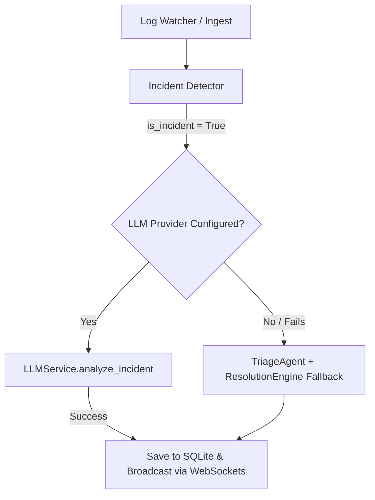

# Design Spec: LLM Provider Integration for Incident Analysis

We want to integrate a flexible Large Language Model (LLM) analysis layer to replace the rule-based triage and resolution recommendation stages in our incident dashboard.

---

## 1. Objectives & Capabilities

- **Multi-Provider Support:** Seamlessly swap between Local LLMs (Ollama, LM Studio) and Cloud APIs (OpenAI, Gemini).
- **Unified Configuration:** Read provider type, model name, base URL, and credentials from a standard `.env` configuration file.
- **Structured JSON Schema Output:** Use client SDK features to guarantee the LLM returns structured JSON matching our dashboard keys.
- **Fail-Safe Fallbacks:** Automatically fall back to our existing regex-based Python triage and resolution modules if the LLM provider is offline, times out, or fails to parse.

---

## 2. Configuration Schema (`.env`)

```ini
# Configures the active provider: 'openai', 'gemini', 'ollama', or 'lmstudio'
LLM_PROVIDER=ollama

# API Keys (required for openai and gemini; can be empty for local hosts)
OPENAI_API_KEY=
GEMINI_API_KEY=

# Custom API base URL (required for ollama/lmstudio)
# Ollama default: http://localhost:11434/v1
# LM Studio default: http://localhost:1234/v1
LLM_BASE_URL=http://localhost:11434/v1

# Target Model Name
# e.g., 'llama3' (Ollama), 'gpt-4o-mini' (OpenAI), 'gemini-1.5-flash' (Gemini)
LLM_MODEL=llama3
```

---

## 3. Architecture & File Layout

We will introduce a new LLM service module:

- **`backend/services/llm.py`:**
  - Standardizes the provider wrapper class `LLMService`.
  - Maps configuration keys on startup and instantiates the proper client instance (`openai.OpenAI` or `google.genai.Client`).
  - Implements `analyze_incident(raw_line: str, severity: str) -> dict`.



---

## 4. Prompt & JSON Output Schemas

The prompt supplied to the LLM will be structured as:

```
You are an expert incident response system. Analyze the following raw log line and classified severity:
Raw Log: [RAW_LOG_LINE]
Detected Severity: [SEVERITY]

Analyze the incident and respond with a structured JSON object containing:
- category: One of "Network", "Security", "Compute", "Storage", "Application"
- priority: One of "P0", "P1", "P2", "P3", "P4"
- recommendation: A concise markdown-formatted recovery runbook/resolution steps.
```

To prevent JSON parsing failures, we will use the native SDK schema features:
- For OpenAI/Ollama/LM Studio: `response_format={"type": "json_object"}` or Pydantic validation.
- For Gemini: `config=GenerateContentConfig(response_mime_type="application/json", response_schema=...)`.

---

## 5. Integration Details (`backend/orchestrator.py`)

In `orchestrator.py`:
- Instantiate `LLMService` in `__init__`.
- In `start_pipeline`:
  ```python
  # If incident is detected
  triage = None
  resolution = None
  if detection.get("is_incident"):
      try:
          llm_result = llm_service.analyze_incident(raw_line, detection.get("severity"))
          triage = {
              "category": llm_result.get("category", "Application"),
              "priority": llm_result.get("priority", "P4")
          }
          resolution = {
              "status": "pending",
              "playbook_used": resolver.get_playbook_steps(triage["category"], detection.get("severity")),
              "steps_executed": [],
              "recommendation": llm_result.get("recommendation", "")
          }
      except Exception as e:
          # Log error and trigger fallback
          print(f"LLM analysis failed, falling back to rule-based: {e}")
          triage = triage_agent.transform(detection)
          resolution = resolution_engine.resolve(triage)
  ```
