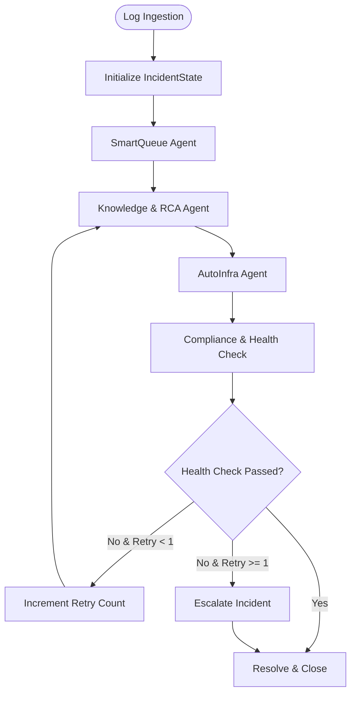

# Design Spec: LangGraph Multi-Agent Incident Orchestration

This design spec outlines the integration of LangGraph into our Incident Dashboard POC backend to support stateful multi-agent workflows, real-time WebSocket state streaming, and background task execution. It also specifies the frontend Timeline UI for visual status tracking.

---

## 1. Objectives & Capabilities

- **Stateful Multi-Agent Graph**: Model the incident triage, root cause analysis, playbook execution, and health validation as nodes in a LangGraph state graph.
- **Asynchronous Background Execution**: Run the LangGraph workflow in a FastAPI background task to return HTTP responses instantly on ingestion, keeping system operations non-blocking.
- **Real-Time Progress Streaming**: Broadcast status updates, command logs, and final resolutions to all connected frontend clients via WebSockets at each node transition.
- **Self-Healing Loop**: Implement a retry loop in the graph. If a simulated post-remediation health check fails, the graph loops back to the Knowledge/RCA node to attempt an alternative resolution before escalating.

---

## 2. Configuration & Dependencies

We will add the `langgraph` package to our backend:
- `backend/requirements.txt` will be updated to include `langgraph`.

---

## 3. Database Schema Updates (`data/incidents.db`)

We will extend the `incidents` table in the SQLite database to store the state updates of the agents:
- Add a new column `agent_history` (TEXT) containing a JSON-serialized list of execution logs.
- Structure of each event in the `agent_history` list:
  ```json
  {
    "node": "SmartQueue",
    "status": "running" | "completed" | "failed",
    "message": "Classified category as Compute, priority as P2",
    "timestamp": "2026-07-02T21:30:00Z"
  }
  ```

---

## 4. LangGraph Agent State & Nodes

### Shared State (`IncidentState`)
```python
from typing import TypedDict, List, Dict, Any, Optional

class IncidentState(TypedDict):
    incident_id: int
    raw_log: str
    severity: str
    category: Optional[str]
    priority: Optional[str]
    playbook_steps: List[str]
    steps_executed: List[str]
    recommendation: str
    agent_history: List[Dict[str, Any]]
    health_check_passed: bool
    status: str
    retry_count: int
```

### Graph Nodes
1. **`smart_queue_node`**: Triage Agent. Runs the `TriageAgent` logic or LLM to determine category and priority.
2. **`knowledge_rca_node`**: Knowledge & RCA Agent. Selects a playbook checklist and recommendations.
3. **`auto_infra_node`**: Remediation Agent. Simulates executing playbook steps. Progressively check off checklist steps and log command execution outputs.
4. **`compliance_health_node`**: IT & Compliance Agent. Runs a simulated system health verification. Sets `health_check_passed = True` (or `False` on the first run of a critical incident to trigger routing).

### Routing Logic


---

## 5. API & WebSocket Pipeline Flow

1. **Ingest Call (`POST /ingest`)**:
   - Save the raw log to SQLite with initial status `"pending"`.
   - Broadcast the new incident via WebSocket to frontend.
   - Spawn the background task:
     ```python
     background_tasks.add_task(run_langgraph_pipeline, incident_id, raw_line, severity)
     ```
   - Return the initial incident payload immediately with status `200 OK`.
   
2. **Pipeline Worker (`run_langgraph_pipeline`)**:
   - Instantiates the `IncidentState` and compiles/runs the graph.
   - At each node, the state writes to SQLite and broadcasts the updated incident (with populated `agent_history` and `status`) to all connected WebSocket clients.

---

## 6. Frontend UI: Collapsible Right Agent Sidebar

The Inspector Pane (Right Pane) on Next.js will be extended:
1. **Toggle Button**: Introduce an "🤖 Agent Trace" button to open/close the Agent Timeline sidebar.
2. **Vertical Progress Timeline**:
   - Render nodes: SmartQueue, Knowledge/RCA, AutoInfra, and Compliance.
   - Status indicators (gray dot for pending, pulsing spinner for running, checkmark for completed, red triangle for failed).
3. **Live Outputs**:
   - Render the text messages from `agent_history` in real time as WebSocket updates are received.
